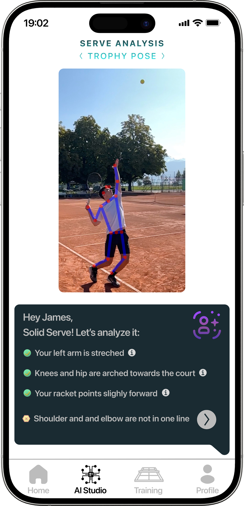

# 🎾 Tennis AI Coach

An **on-device computer vision app** that analyzes tennis serves in real time.  
The app detects body keypoints and ball trajectories, measures serve speed, and generates **concise technique feedback** — all directly on your iPhone.  
👉 [Watch the demo video here](https://youtu.be/GdJaosgI6JI?si=bANF1ydVb1aY-vH8).

  

---

## 🚀 Features

- **Serve speed estimation**  
  Tracks the tennis ball trajectory frame-by-frame and overlays velocity in real time

- **Technique feedback**  
  Detects *trophy pose* and *contact point*, providing actionable, rule-based coaching tips

- **On-device ML**  
  Built with Apple's Vision framework (`VNHumanBodyPoseObservation`, `VNDetectTrajectoriesRequest`), ensuring low-latency analysis, offline usability, and privacy

- **Instant overlays**  
  Frame-accurate SwiftUI/UIView rendering shows both ball path and body pose feedback directly on video

---

## 🏃‍♂️ Run it locally (iOS 16+)

### Prereqs
- **Xcode 14.3+** (iOS 16 SDK or newer)
- **iPhone or iPad on iOS 16+** (recommended; camera/Vision work best on device)
- Apple Developer account for code signing (free is fine)

### 1) Get the code, open in Xcode and enable permissions
- `git clone https://github.com/ChristianCadisch/AI-serve-feedback.git`
- Open the project in Xcode
- Select the **TennisAICoach** scheme (top-left)

Add these keys if not present (Target → *Info*):
- `Privacy - Camera Usage Description` → *Needed to analyze your serve in real time*
- `Privacy - Photo Library Usage Description` → *Needed to pick serve videos for analysis*
- (Optional) `Privacy - Photo Library Additions Usage Description` → *Needed to save annotated videos/screenshots*

### 2) Code signing, developer mode and running
- Target → *Signing & Capabilities* → select your **Team**
- Change **Bundle Identifier** to something unique (e.g., `com.yourname.tennisaicoach`)
  
On iOS 16+: **Settings → Privacy & Security → Developer Mode → On** (device will reboot)

- Plug in your device (or use Wi-Fi debugging)
- In Xcode, choose your device as the run destination
- **Run** (⌘R)

> 💡 Simulator note: Vision pose/trajectory and camera capture are limited in the simulator. Use a **real device** for live capture and the most accurate results. You can still test with picked videos via the gallery

### 3) Use the app
- **Record on-court** or **pick an existing serve video**
- The app overlays **pose + ball trajectory**, shows **serve speed**, and displays **technique tips** (trophy pose/contact)

### Troubleshooting
- **“Failed to register bundle identifier”** → change the Bundle ID to a unique value
- **Provisioning/profile errors** → ensure a Team is selected under *Signing & Capabilities*
- **No camera/video feed** → check Camera/Photos permissions in *Settings → App Name*

---

## 🧠 Technical Implementation

- **Pose Estimation**: Apple Vision’s `VNHumanBodyPoseObservation` with custom temporal smoothing to stabilize joints across frames and detect serve phases
- **Trajectory Analysis**: Real-time ball tracking using `VNDetectTrajectoriesRequest` with polynomial/parabolic fits and confidence thresholds
- **Speed Computation**: Velocity derived from timestamps, trajectory length, and extrapolated early path segments 
- **AI Coaching Logic**:  
  - Implemented in [`AICoach.swift`](./AICoach.swift):contentReference[oaicite:2]{index=2}  
  - Uses joint angle calculations, elbow/shoulder thresholds, wrist height derivatives
  - Provides rule-based feedback (e.g., "bend knees more", "ensure arm is fully extended" 
- **On-Device Pipeline**: Entire inference loop runs locally (AVFoundation + Vision), no server calls

---

## 📬 Contact

If you run into issues, have questions, or want to contribute, feel free to reach out:

- ✉️ Email: [christian.cadisch@gmail.com](mailto:christian.cadisch@gmail.com)  
- 💼 LinkedIn: [linkedin.com/in/cadisch](https://www.linkedin.com/in/cadisch)  
- 🐙 GitHub: [github.com/ChristianCadisch](https://github.com/ChristianCadisch)

Always happy to connect and improve the project together!

---

## 🛠️ Roadmap

- [ ] UI/UX refinements before App Store release   
- [ ] Cloud sync of training sessions and progress tracking
- [ ] Combine technique feedback with [serve speed tracking](https://github.com/ChristianCadisch/Serve-speed-detector/) for integrated analysis  

